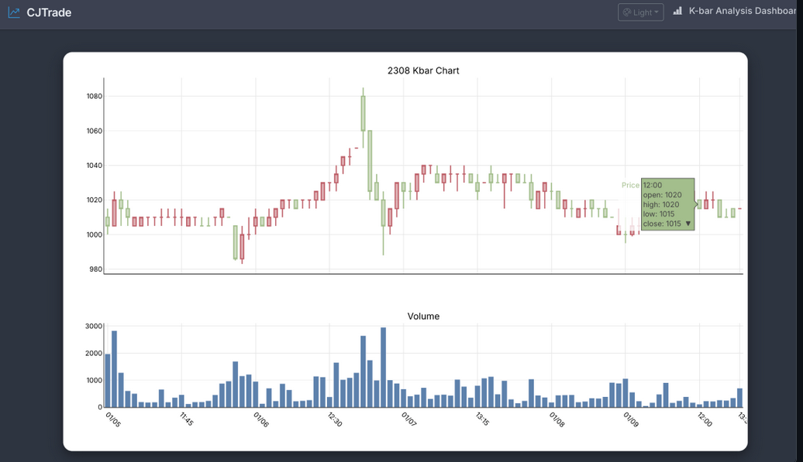
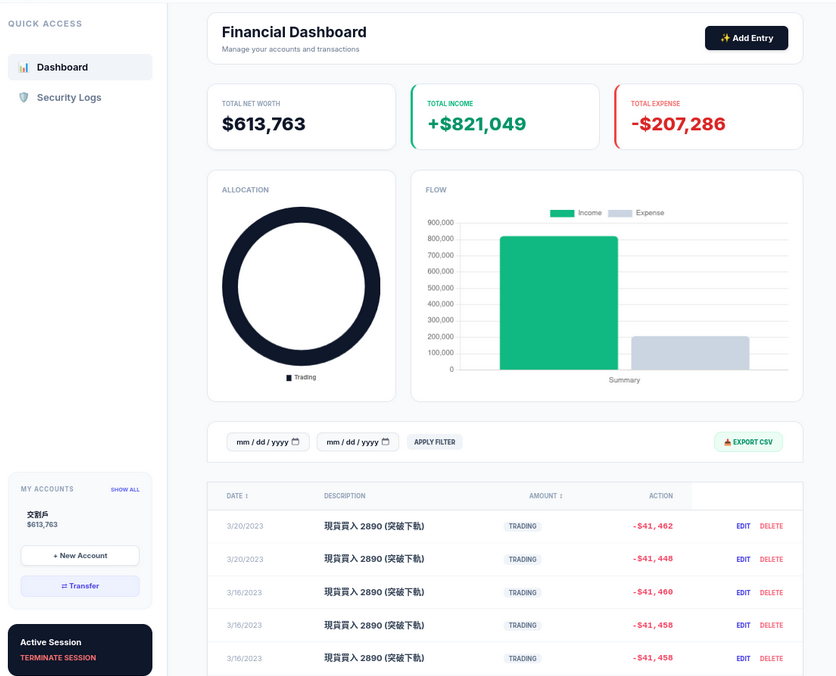
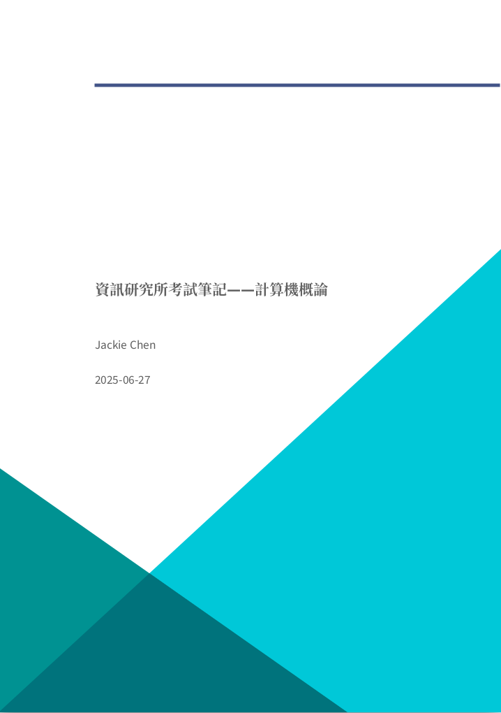
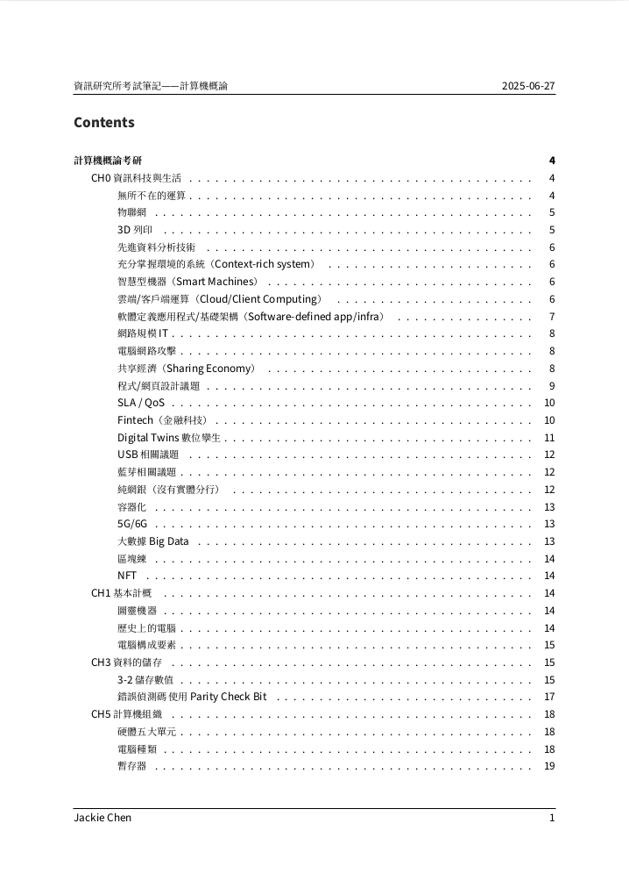
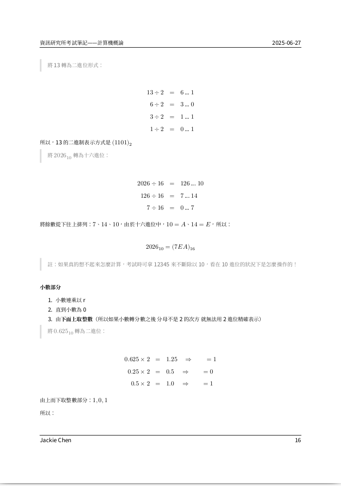

># Jackie (Shou-Chi) Chen

[**Education**](./index.html)
[**Experience**](./experience.html)
[**Side Projects**](./sideproject.html)
[**Open Source**](./opensource.html)
[**Hobbies**](./hobbies.html)
[**Contact**](./contact.html)
[**Available Products**](./product.html)

## Available Products -- CJTrade

[**CJTrade**]()

Quant Trading / SDK / Python

A broker-agnostic trading system Python SDK for Taiwan securities, providing unified APIs for order execution, market data, and strategy integration, with 3 ready-to-use trading applications. 

| 組合 | 價格 | 購買 |
|-|-|-|
| A: Python SDK | NT $99 | [`Buy`](mailto:jackiesogi@gmail.com?subject=[BUY]%20CJTrade&body=I%20would%20like%20to%20buy%20Plan%20A) |

<!-- | 技術分析 | 管理面板 |
|-|-|-|
|  |  | -->

## Available Products -- Note

[**資訊研究所考試筆記**]()

- 針對台、清、交、成、兩科，資訊相關科系的研究所考試。
- 今年新增了量子電腦、大型語言模型等時事。

| 封面 | 目次 | 內頁 |
|-|-|-|
|  |  |  |

| 組合 | 價格 | 購買 |
|-|-|-|
| A: 個人化線上指導 1 小時 + 考研筆記 + 頂大面試考古題/筆記 | NT $1,500 | [`Buy`](mailto:jackiesogi@gmail.com?subject=[BUY]%20Note&body=I%20would%20like%20to%20buy%20Plan%20A) |
| B: 考研筆記 + 頂大面試考古題/筆記 | NT $1,200 | [`Buy`](mailto:jackiesogi@gmail.com?subject=[BUY]%20Note&body=I%20would%20like%20to%20buy%20Plan%20B) |
| C: 考研筆記 | NT $1,000 | [`Buy`](mailto:jackiesogi@gmail.com?subject=[BUY]%20Note&body=I%20would%20like%20to%20buy%20Plan%20C) |
| D: 頂大面試考古題/筆記 | NT $500 | [`Buy`](mailto:jackiesogi@gmail.com?subject=[BUY]%20Note&body=I%20would%20like%20to%20buy%20Plan%20D) |
